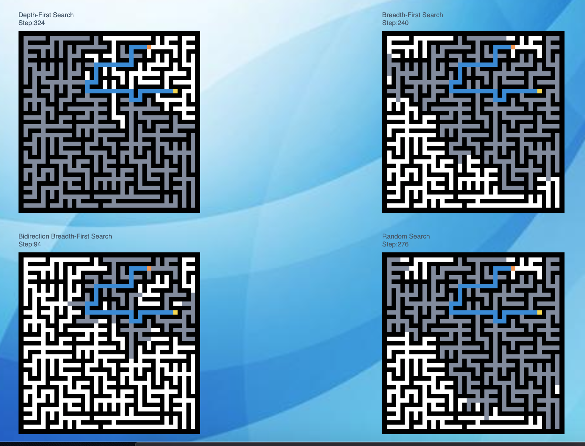

# Maze Vaisulizer 

## Background and Overview
Using HTML Canvas to render four identical mazes to show the speed of each algorithem search for a sucessful path.

## Four Alrogithem
* Depth-First Search 
* Breadth-First Search
* Bidirection Breadth-First Search
* Random Search

## Functionality and MVP Features
*  Each algorithem garanteed to find a successful path for each rendered maze 
* "generate maze" button renders new four identical mazes each time 
* Each alrogithem search has a description and implementation
 
## Architecture and Technologies
* Graph
  * Prim's Algorithm
* Technologies
  * Javascript, Canvas, HTML, CSS
    

